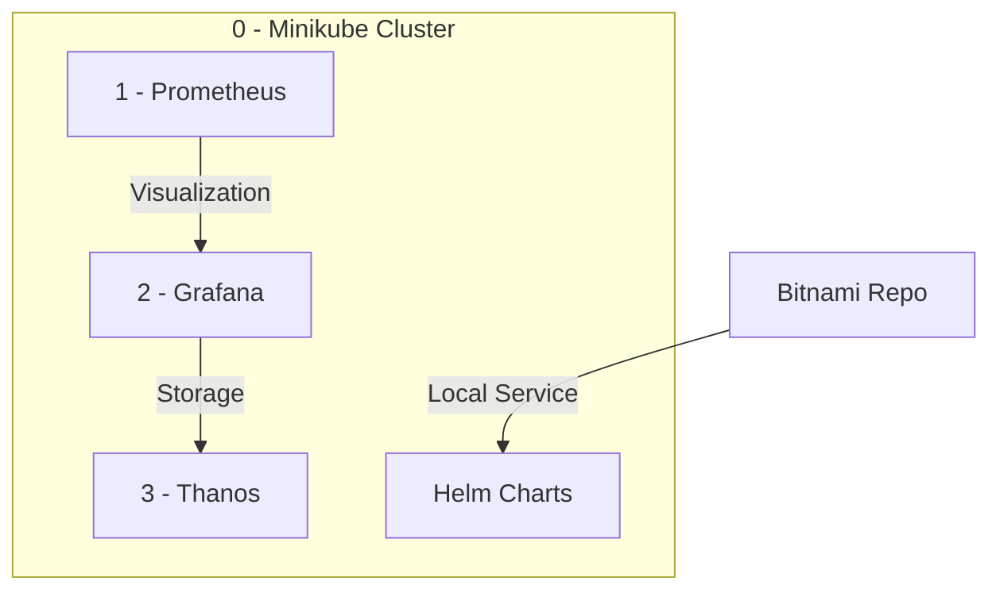

```markdown
## Minikube IP Address
The Minikube IP address is `192.168.49.2`.

## Kubernetes Services
Here are the services running in the Kubernetes cluster:

| NAMESPACE   | NAME         | TYPE        | CLUSTER-IP       | EXTERNAL-IP | PORT(S)                  | AGE  |
|-------------|--------------|-------------|------------------|-------------|--------------------------|------|
| default     | kubernetes   | ClusterIP   | 10.96.0.1        | <none>      | 443/TCP                  | 9m6s |
| kube-system | kube-dns     | ClusterIP   | 10.96.0.10       | <none>      | 53/UDP,53/TCP,9153/TCP   | 9m5s |
| monitoring  | prometheus   | NodePort    | 10.101.225.175   | <none>      | 9090:30000/TCP           | 2m3s |
```