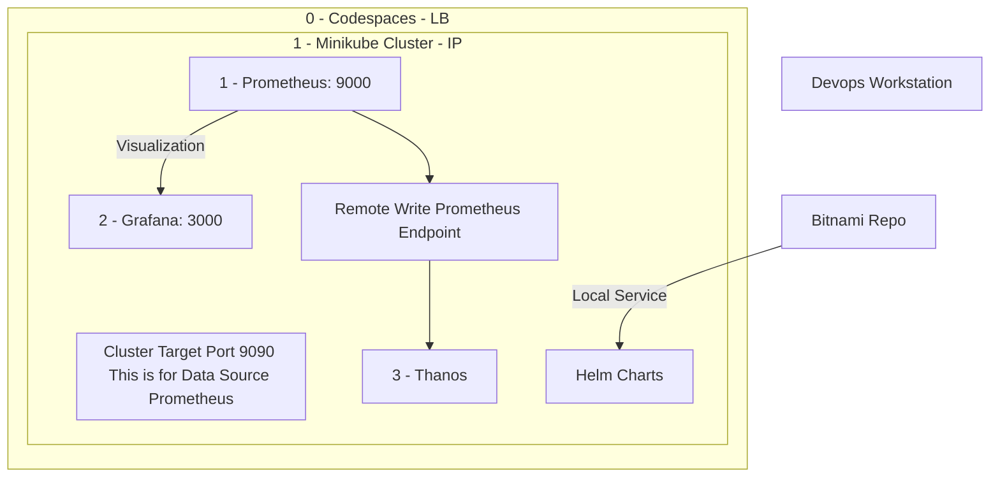

		
## Minikube IP Address
The Minikube IP address is `192.168.49.2`.

## Kubernetes Services
Here are the services running in the Kubernetes cluster:

| NAMESPACE   | NAME         | TYPE        | CLUSTER-IP       | EXTERNAL-IP | PORT(S)                  | AGE  |
|-------------|--------------|-------------|------------------|-------------|--------------------------|------|
| default     | kubernetes   | ClusterIP   | 10.96.0.1        | <none>      | 443/TCP                  | 9m6s |
| kube-system | kube-dns     | ClusterIP   | 10.96.0.10       | <none>      | 53/UDP,53/TCP,9153/TCP   | 9m5s |
| monitoring  | prometheus   | NodePort    | 10.101.225.175   | <none>      | 9090:30000/TCP           | 2m3s |


## Prometheus Service Details

```plaintext
Name:                     prometheus
Namespace:                monitoring
Labels:                   <none>
Annotations:              <none>
Selector:                 app=prometheus
Type:                     NodePort
IP Family Policy:         SingleStack
IP Families:              IPv4
IP:                       10.101.225.175
IPs:                      10.101.225.175
Port:                     <unset>  9090/TCP
TargetPort:               9090/TCP
NodePort:                 <unset>  30000/TCP
Endpoints:                10.244.0.3:9090
Session Affinity:         None
External Traffic Policy:  Cluster
Internal Traffic Policy:  Cluster
Events:                   <none>
```